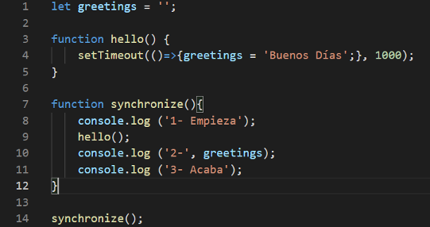
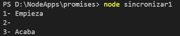

Ejemplo de uso del objeto Promise y de las palabras Async/await para manejar la asincronía no bloqueante que es característica de javascript.

El ejemplo contiene tres piezas de código:

1) sincronizar1.js  
   </img>
   En este código se muestra como la función setTimeout desencadena una función asíncrona que asigna valor a una variable global. El resultado de ejecutar
   sincronizar1.js es: 
   </img>

2) sincronizar2.js En este código se muestra el mismo ejemplo y cómo con un objeto de tipo Promesa se accede al valor de la variable global cuando esta está cargada.
3) sincronizar3.js En este código se muestra el mismo ejemplo combinando la Promesa con el uso de las palabras clave Async/await, consiguiendo ejecutar las sentencias
   en el orden deseado.
