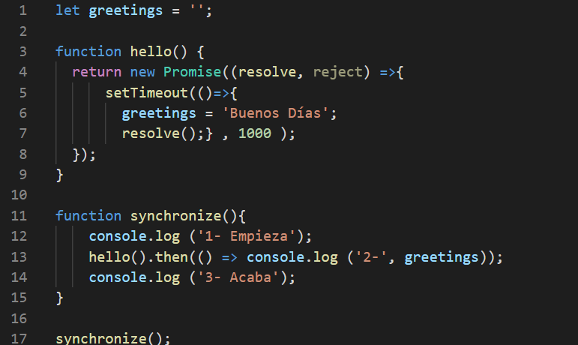
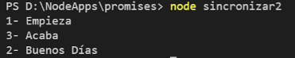
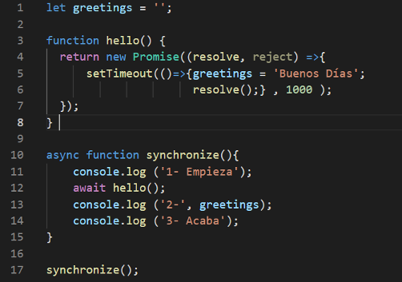

Ejemplo de uso del objeto Promise y de las palabras Async/await para manejar la asincronía no bloqueante que es característica de javascript.

El ejemplo contiene tres piezas de código:

1) sincronizar1.js  
   </img>  
   En este código se muestra como la función setTimeout desencadena una función asíncrona no bloqueante que asigna valor a una variable global. El resultado de ejecutar
   sincronizar1.js es:  
   </img>  
   El resultado es que cuando se muestra la variable todavía no ha pasado un segundo y contiene el valor inicial, es decir nada.  

2) sincronizar2.js  
   </img>  
   En este código se muestra el mismo ejemplo y cómo con un objeto de tipo Promesa se accede al valor de la variable global cuando esta está cargada.  
   </img>  
   El resultado es que cuando se ejecuta el método .then del objeto Promise, la variable ya está cargada con el valor 'Buenos dias'. Pero el console log del método 
   .then se ejecuta al final.  <
4) sincronizar3.js  
   </img>  
   En este código se muestra el mismo ejemplo combinando la Promesa con el uso de las palabras clave Async/await, consiguiendo ejecutar las sentencias
   en el orden deseado.  
   </img>  
   El resultado es que además de que la variable contiene 'Buenos días' las sentencias console se muestran en orden 1, 2 y luego 3.
   
   Quieres ver una explicación en video <a href="https://youtu.be/zbfKBbQlFzw">Mira aqui<a/>
